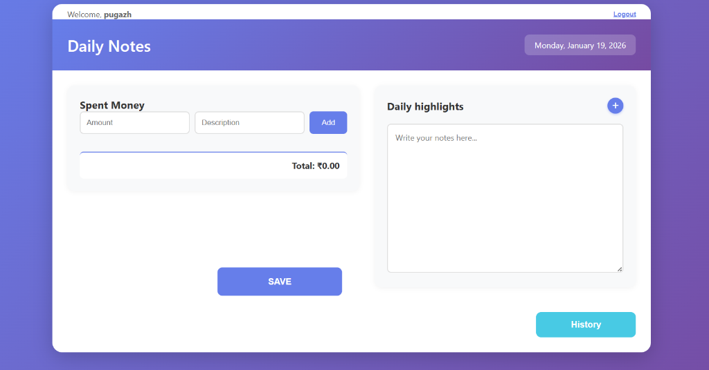

# 📓 Daily Notes

A full-stack personal diary and expense tracker with AI-powered features — built with React, Node.js, MongoDB, and Groq (LLaMA 3.3).



🔗 **Live Demo:** [https://daily-notes-red.vercel.app](https://daily-notes-red.vercel.app)

---

## ✨ Features

### 📝 Daily Notes
- Write and save daily highlights with numbered point support
- **AI Grammar Fix** — one click corrects spelling, grammar, and punctuation using LLaMA 3.3

### 💸 Expense Tracker
- Add expenses with description and amount
- **Auto-categorize** — AI automatically tags each expense (Food, Groceries, Transport, Clothing, Entertainment, Health, Education, Utilities, Shopping, Travel, Other)
- Color-coded category badges on every item
- Running total displayed at the bottom

### 📊 Analytics
- View spending breakdown by category
- Toggle between **This Week** and **This Month**
- Visual bar chart with percentages for each category
- Grand total summary

### 🔍 Natural Language Search
- Search your entire diary in plain English
- Example: *"days I spent on milk or vegetables"*, *"when did I buy groceries?"*
- AI scans all your entries and returns a human-readable answer + matching day cards

### 🤖 AI Chat Sidebar
- Persistent chat panel powered by LLaMA 3.3 (via Groq)
- Ask anything about your data:
  - *"What did I do last week?"*
  - *"Where did I spend the most money?"*
  - *"Show my food expenses this month"*
- Full diary context included in every response
- Quick suggestion chips for common questions

### 📅 History Modal
- Browse any past date using a calendar picker or arrow navigation
- Keyboard arrow key navigation (← →)
- Swipe gestures on mobile
- Page-flip animation when switching dates
- Delete individual expense items or clear an entire day

### 🔐 Authentication
- JWT-based login and registration
- Tokens persist for 30 days
- All data is private and user-scoped

---

## 🛠 Tech Stack

| Layer | Technology |
|-------|-----------|
| Frontend | React 19, Vite 7 |
| Backend | Node.js, Express 5 |
| Database | MongoDB Atlas, Mongoose |
| AI | Groq API (LLaMA 3.3 70B) |
| Auth | JWT + bcrypt |
| Deployment | Vercel (frontend + serverless backend) |
| Styling | Pure CSS with CSS custom properties |

---

## 📁 Project Structure

```
Daily-Notes/
├── src/                          # React frontend
│   ├── components/
│   │   ├── Header.jsx            # App header with date display
│   │   ├── NotesSection.jsx      # Notes textarea + grammar fix button
│   │   ├── SpentMoneySection.jsx # Expense input + auto-categorize
│   │   ├── ActionButtons.jsx     # Save, History, Search, Analytics, AI Chat
│   │   ├── HistoryModal.jsx      # Browse past diary entries
│   │   ├── AnalyticsModal.jsx    # Category spending charts
│   │   ├── SearchModal.jsx       # Natural language diary search
│   │   ├── AIChatSidebar.jsx     # AI chat panel
│   │   ├── Login.jsx             # Login form
│   │   └── Register.jsx          # Registration form
│   ├── context/
│   │   └── AuthContext.jsx       # Auth state management
│   ├── api.js                    # All frontend API calls
│   ├── App.jsx                   # Main app shell
│   ├── index.css                 # Global dark theme styles
│   └── main.jsx                  # React entry point
│
├── server/                       # Express backend
│   ├── models/
│   │   ├── DayEntry.js           # Diary entry schema (notes + expenses)
│   │   └── User.js               # User schema
│   ├── routes/
│   │   ├── auth.js               # Register + Login routes
│   │   └── ai.js                 # All AI routes (Groq)
│   ├── middleware/
│   │   └── auth.js               # JWT verification middleware
│   ├── index.js                  # Express app + all day routes
│   └── .env                      # Environment variables
│
├── vercel.json                   # Vercel deployment config
└── vite.config.js                # Vite config with API proxy
```

---

## 🚀 Getting Started

### Prerequisites
- Node.js 18+
- MongoDB Atlas account
- Groq API key (free at [console.groq.com](https://console.groq.com/keys))

### 1. Clone the repository

```bash
git clone https://github.com/your-username/daily-notes.git
cd daily-notes
```

### 2. Install dependencies

```bash
# Frontend
npm install

# Backend
cd server
npm install
```

### 3. Configure environment variables

Create `server/.env`:

```env
MONGO_URI=your_mongodb_atlas_connection_string
PORT=5000
JWT_SECRET=your_secret_key_here
GROQ_API_KEY=gsk_your_groq_api_key_here
```

### 4. Run the app

```bash
# From the project root — starts both frontend and backend
npm run dev
```

- Frontend: [http://localhost:5173](http://localhost:5173)
- Backend: [http://localhost:5000](http://localhost:5000)

---

## 🌐 Deployment (Vercel)

This project is configured for Vercel with a single `vercel.json` that serves:
- The React build as a static site
- The Express server as serverless functions at `/api/*`

### Steps

1. Push code to GitHub
2. Import the repo in [vercel.com](https://vercel.com)
3. Add these environment variables in Vercel project settings:

| Variable | Value |
|----------|-------|
| `MONGO_URI` | Your MongoDB Atlas URI |
| `JWT_SECRET` | Any random secret string |
| `GROQ_API_KEY` | Your Groq API key |

4. Deploy — Vercel handles the rest

> **MongoDB Atlas:** Make sure Network Access allows `0.0.0.0/0` so Vercel's dynamic IPs can connect.

---

## 🤖 AI Features — How They Work

All AI features use the **Groq API** with the `llama-3.3-70b-versatile` model.

### Auto-Categorize
When you add an expense, the description is sent to the AI which returns one of 11 categories. The category is stored in the database alongside the amount and description.

### Grammar Fix
Your full notes text is sent to the AI with instructions to correct spelling and grammar without changing the meaning. The corrected text replaces your original notes in-place.

### Natural Language Search
All your diary entries are serialized into a compact summary and sent to the AI with your query. The AI returns a JSON response with a natural language answer and a list of matching dates. The matched entries are then fetched and displayed as cards.

### AI Chat
The entire diary history (all dates, notes, expenses, category totals) is included as system context. The chat history is passed as a proper multi-turn conversation so the AI remembers what was said earlier in the session.

### Analytics
No AI involved — purely computed from the database. Expenses are grouped by their stored `category` field and summed for the selected period.

---

## 📊 Data Model

### DayEntry
```js
{
  date: String,         // "YYYY-MM-DD"
  userId: ObjectId,     // Reference to User
  notes: String,        // Daily highlights text
  spentMoney: [{
    description: String,
    amount: Number,
    category: String    // Auto-assigned by AI
  }],
  lastModified: Date
}
```

### User
```js
{
  username: String,     // Unique
  password: String,     // bcrypt hashed
  createdAt: Date
}
```

---

## 📱 Responsive Design

The app is fully responsive:
- **Desktop** — two-column layout (expenses left, notes right)
- **Mobile** — single column, stacked layout
- **History modal** — swipe left/right to navigate dates on touch devices

---

## 📄 License

MIT
